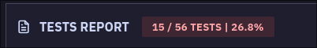
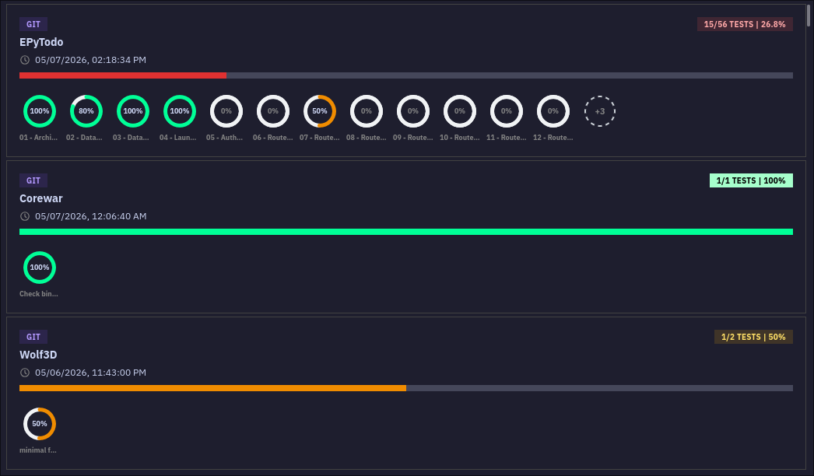

  <h1>MyEpitechPercentage</h1>
   
  <strong>Brings percentage to https://my.epitech.eu !</strong>

## Preview

In full project display

In list view

## Installation

The extension is available on the [Firefox Add-ons store](https://addons.mozilla.org/en-US/firefox/addon/myepitechpercentage/). It works on Desktop and Android versions of Firefox.
